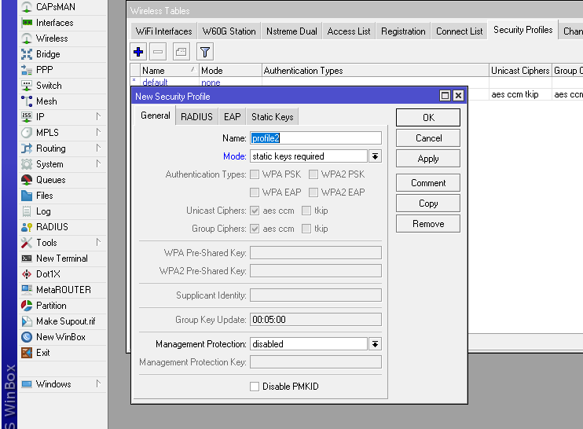
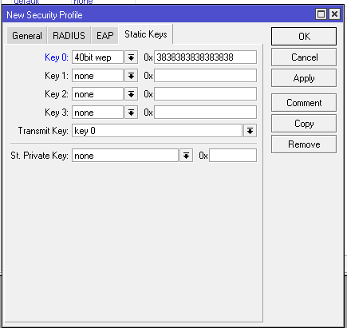
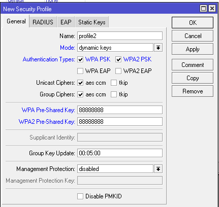
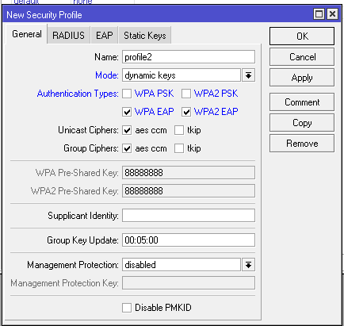
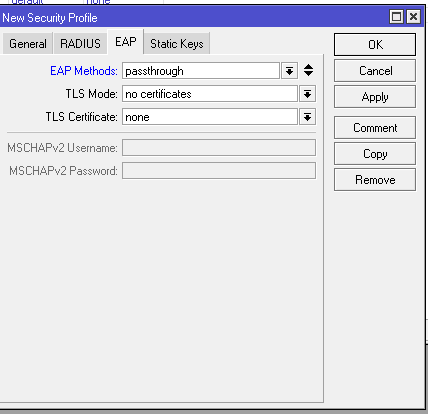
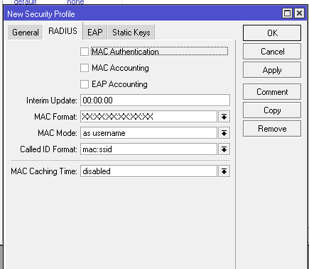

# LAB-44-Wireless-security
tanggal 24 agustus 2025

# wireless security
Wireless Security adalah sistem perlindungan yang digunakan untuk menjaga agar jaringan WiFi tetap aman dari akses yang tidak sah dan gangguan luar. Ada dua jenis security yang biasa diimplementasikan dalam jaringan wireless, WEP & WPA. Kedua security ini merupakan wireless security yang berbeda generasi yang pastinya banyak perbedaan dan tingkat keamanan.

**WEP (Wired Equivalent Privacy)**   
Versi awal security wireless adalah WEP yang diperkenalkan pada September 1999. Bekerja dengan menggunakan stream cipher untuk menjaga kerahasiaan data dan menggunakan CRC-32 checksum untuk memastikan keutuhan data pada saat terjadi trasmisi data. WEP juga menggunakan sebuah key. WEP Keys terdiri dari 40 hingga 128bits yang biasanya didefinisikan secara statik di perangkat AP dan Client sehingga bisa saling berkomunikasi. Saat ini WEP sudah tidak banyak digunakan disebabkan karena WEP rentan terhadap serangan dan sudah dapat dilakukan cracking.

**WPA (Wi-Fi Protected Access)**
WPA merupakan generasi lanjutan dari WEP. Dikembangkan karena kerentanan WEP Security terhadap serangan. Untuk algoritma enkripsi WPA menggunakan Temporal Key Integrity Protocol (TKIP) atau bisa juga menggunakan Advanced Encryption Standard (AES) dengan kemampuan encrypt lebih tinggi. Pengembangan dari WPA adalah WPA2 yang dalam proses enkripisi nya bisa menggunakan kombinasi TKIP dan AES.   
Dalam hal authentikasi, WPA/WPA2 dapat menerapkan :
1. Pre-Shared-Key : WPA-PSK / WPA2-PSK  (WPA Personal)
2. EAP : WPA-EAP / WPA2-EAP
3. RADIUS Server : Dengan mode WPA-EAP dapat diterapkan authentikasi terpusat pada RADIUS server (WPA Enterprise)

# mikrotik wireless security
untuk melakuan konfigurasi Wireless Security di MikroTik bisa di setting pada menu **Wireless > Security Profiles.** dan klik (+) untuk menambah yang baru.   
berikut penjelasan secara singkat tentang mode security profile di wireless:

  **1. None**	Tidak menggunakan otentikasi/enkripsi (jaringan terbuka/Open) dan jika ada frame yang telah dienkripsi maka tidak diterima. 
 
  **2. Static-keys-optional** Berjalan di WEP mode. Support encription dan decryption, akan tetapi mengijinkan perangkat wireless untuk menerima dan mengirim frames yang tidak dienskripsi. Perangkat akan mengirimkan frames yang tidak dienskripsi jika algoritma enskripsi diset none. Wireless station yang menggunakan ke AP yang menggunakan mode static keys required.   
 
  **3. Static keys-required** Digunakan pada mode WEP. Router tidak menerima dan mengirim frame yang tidak dienkripsi. Jika mode inii ditetapkan pada sisi station, maka hanya bisa terkoneksi ke AP dengan mode yang sama.   
 
  **4.Dynamic Keys** Dynamic Keys Mode autentikasi EAP (Extensible Authentication Protocol) yang disupport oleh Mikrotik adalah EAP-TLS, dimana proses autentikasi dilakukan dengan mengunakan CA Certificate. Mode PSK (Pre Shared Key), dukungan keamanan dari enskripsi WPA/WPA2 dan cara setting yang mudah.  

# Konfigurasi Wireless Security

**WEP Static Keys**

1. pilih menu wireless pilih tab security , lalu klik (+) atau edit yang sudah ada. 

2. Dalam penggunaan WEP kita harus melakukan set WEP-Key terlebih dahulu, melakukan convert sebuah kata ke dalam bentuk bilangan hexadecimal pada layanan WEP Key Generator yang banyak terdapat di internet.

3. pilih tab satatic key, masuk ke kolom 0x

**WPA/WPA2 PSK**

1. pilih menu wireless pilih tab security , lalu klik (+) atau edit yang sudah ada.       
   Pilih Dynamuic keys lalu checklist **WPA/WPA1 PSK**, setelah itu masukan password dibagian WPA/2 Pre-Shared Key. 

**WPA/WPA2 EAP**

1. pilih menu wireless pilih tab security , lalu klik (+) atau edit yang sudah ada.    
   Pilih dynamic keys dan checklist WPA/2 EAP.

2. Kita bisa tentukan bagaimana mode WPA EAP ini bekerja. Pindah ke tab EAP.

*EAP METHODS*    
EAP-TLS, menggunakan autentikasi EAP-TLS built-in pada perangkat. Sisi AP dan Client harus mengunakan certificate yang sesuai. lalu Passthrough, AP akan me relay autentikasi ke Radius Server. Tidak ada efeknya jika ditetapkan pada sisi perangkat Client.

*TLS Mode*     
verify certificate, melakukan verifikasi sertifikat. Perangkat yang terkoneksi harus memiliki sertifikat yang valid.  
dont verify certificate, tidak akan melakukan verifikasi sertifikat remote device.   
no certificates, tidak memerlukan sertifikat untuk bisa terkoneksi.   

**RADIUS MAC Authentication**
Selain metode-metodr di atas, kita juga bisa menerapkan autentikasi berdasarkan MAC Address dari Client yang akan terkoneksi.

# keimpulan 
Security profile jaringan mencakup berbagai metode otentikasi dan enkripsi seperti **WEP Static Keys** (kurang aman), **WPA/WPA2 PSK** (cukup aman untuk jaringan kecil), **WPA/WPA2 EAP** dengan **RADIUS** (tingkat keamanan tinggi untuk skala besar), serta **MAC Authentication** (lemah dan hanya cocok sebagai pelengkap), yang masing-masing memiliki tingkat keamanan, kompleksitas, dan penerapan yang berbeda sesuai kebutuhan jaringan.
# sumber 
https://citraweb.com/artikel/93/
